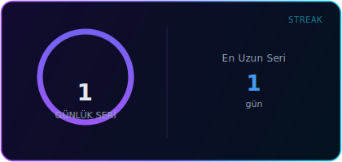

<!--
  ⚙️ Otomatik güncellenen bölümler: blog kartları (blog-posts.yml, 6 saatte bir),
  GitHub istatistikleri (stats-cache.yml, günlük) + yılan (snake.yml, günlük).
  🎨 Header / divider / footer / terminal görselleri: assets/ klasöründeki el yapımı
  animasyonlu SVG'ler — harici servis yok.
  📖 Kurulum: KURULUM-REHBERI.md
-->

<!-- ═══ El yapımı animasyonlu header — assets/header.svg ═══ -->

  

&nbsp;
&nbsp;

## ⚡ whoami

## 🧰 Stack

**Frontend & Frameworks**

**Backend & Data**

**DevOps & System**

## 🚀 Projeler

<table>
  <tr>
    <td width="50%" valign="top">
      🧩 <b><a href="https://www.muhammedkoca.com.tr/projeler/mhfw-mhs-framework">MhFW — Mhs Framework</a></b> 
      Python + React üzerine sıfırdan yazdığım modüler full-stack framework — DI, Redis cache katmanı
    </td>
    <td width="50%" valign="top">
      🛒 <b><a href="https://www.muhammedkoca.com.tr/projeler/fastcom-next-js-16-multi-tenant-multi-vendor-e-commerce-saas-engine">FastCom</a></b> 
      Next.js 16 multi-tenant &amp; multi-vendor e-ticaret SaaS motoru — 6 dil, SSE, Redis, ACID
    </td>
  </tr>
  <tr>
    <td valign="top">
      🏭 <b><a href="https://www.muhammedkoca.com.tr/projeler/sry-production-tracking-system">SRY Production Tracking</a></b> 
      Dinamik vardiya rotasyonlu üretim &amp; performans yönetim sistemi — Excel entegrasyonlu
    </td>
    <td valign="top">
      🕵️ <b><a href="https://www.muhammedkoca.com.tr/projeler/digital-truth">Digital Truth</a></b> 
      Dezenformasyona karşı AI destekli doğruluk kontrolü — Gemini API, Hugging Face, FastAPI
    </td>
  </tr>
  <tr>
    <td valign="top">
      ✅ <b><a href="https://www.muhammedkoca.com.tr/projeler/planter-gercek-zamanli-gorev-yonetim-platformu-web-desktop">PlanTer</a></b> 
      Web &amp; desktop eş zamanlı, offline-first görev platformu — Next.js, Electron, Socket.io
    </td>
    <td valign="top">
      🔳 <b><a href="https://www.muhammedkoca.com.tr/projeler/qrfitr-gelismis-ve-guvenli-qr-kod-platformu">QrFitr</a></b> 
      Güvenlik odaklı, self-hosted dinamik QR kod &amp; analitik platformu — "Cyber Tech" tasarım
    </td>
  </tr>
  <tr>
    <td valign="top">
      🏢 <b><a href="https://www.muhammedkoca.com.tr/projeler/lkd-otomasyon-custom-mvc-enterprise-cms-corporate-portal">LKD Otomasyon</a></b> 
      Framework'süz, sıfırdan OOP MVC enterprise CMS — Redis cache, Google 2FA, RBAC, i18n
    </td>
    <td valign="top">
      ⌨️ <b><a href="https://www.muhammedkoca.com.tr/projeler/auto-typer-pro-premium-automation-suite">Auto Typer Pro</a></b> 
      Win32 düşük seviyeli otomasyon &amp; makro paketi — human emulation, watchdog, crash recovery
    </td>
  </tr>
  <tr>
    <td valign="top">
      🖱️ <b><a href="https://github.com/Mhuseyin7/Manticlicker">Mantı Clicker</a></b> 
      Çoklu tuş destekli, portable tıklama/makro aracı — Python, CustomTkinter
    </td>
    <td valign="top">
      📰 <b><a href="https://www.muhammedkoca.com.tr/projeler/muhammed-koca-blog">Muhammed Koca Blog</a></b> 
      Astro + AI içerik hattı — zero-JS, tam SEO, kendi sunucumda
    </td>
  </tr>
</table>

Tam liste → <a href="https://www.muhammedkoca.com.tr/projeler">muhammedkoca.com.tr/projeler</a>

## 📡 Canlı Durum

## 📊 GitHub

<!-- Bu 4 kart, DOĞRUDAN GitHub API'sinden (scripts/generate_stats.py) üretilir ve
     assets/cache/ altına yazılır. Hiçbir dış render servisine (vercel.app, demolab.com)
     bağımlı değildir — tek veri kaynağı GitHub'ın kendisi. -->
<table align="center">
  <tr>
    <td align="center" width="50%"></td>
    <td align="center" width="50%"></td>
  </tr>
</table>

## ✍️ Son Yazılar

<!-- Bu kartlar scripts/generate_blog_cards.py tarafından üretilir. Kapak görselleri
     sitenin KENDİ og:image'inden alınır (muhammedkoca.com.tr/api/og/cover.svg) —
     URL'yi biz kurmuyoruz, sitenin ürettiği meta etiketi doğrudan kopyalıyoruz. -->
<!-- BLOG-CARDS:START -->
<table>
  <tr>
    <td width="260"></td>
    <td valign="top" width="580">
       21 Tem 2026  
      <a href="https://www.muhammedkoca.com.tr/blog/modern-mikroservis-mimarilerinde-gelecege-dayanikli-sistem-tasarimi-5-kritik-evr"><b>Modern Mikroservis Mimarilerinde Geleceğe Dayanıklı Sistem Tasarımı: 5 Kritik Evrim Adımı</b></a>  
      Mikroservis mimarileri, ölçeklenebilirlik vaatleriyle popülerleşse de prodüksiyonda karşılaşılan gerçek sorunlar genellikle mimari evrim…
    </td>
  </tr>
  <tr><td colspan="2"></td></tr>
  <tr>
    <td width="260"></td>
    <td valign="top" width="580">
       21 Tem 2026  
      <a href="https://www.muhammedkoca.com.tr/blog/kidemli-muhendisler-icin-gelecege-dayanikli-sistem-tasarimi-mimari-evrim-ve-krit"><b>Kıdemli Mühendisler İçin Geleceğe Dayanıklı Sistem Tasarımı: Mimari Evrim ve Kritik Trade-off&#x27;lar</b></a>  
      Sistemler büyüdükçe teknik borç katlanarak artar. Bu makalede, 15 yıllık prodüksiyon tecrübesinden süzülen mimari evrim stratejilerini, geleceğe…
    </td>
  </tr>
  <tr><td colspan="2"></td></tr>
  <tr>
    <td width="260"></td>
    <td valign="top" width="580">
       21 Tem 2026  
      <a href="https://www.muhammedkoca.com.tr/blog/node-js-ve-prisma-ile-yuksek-trafikli-api-lerde-performans-darbogazlarini-ortada"><b>Node.js ve Prisma ile Yüksek Trafikli API&#x27;lerde Performans Darboğazlarını Ortadan Kaldırma Rehberi</b></a>  
      Yüksek trafikli Node.js API&#x27;lerinde karşılaşılan performans darboğazlarını tespit etmek ve çözmek için adım adım bir rehber. Prisma ORM&#x27;in veritabanı…
    </td>
  </tr>
</table>
<!-- BLOG-CARDS:END -->

📡 6 saatte bir <a href="https://www.muhammedkoca.com.tr/rss.xml">rss.xml</a> üzerinden otomatik güncellenir, kapak görselleri sitenin kendi og:image'inden gelir · tümü → <a href="https://www.muhammedkoca.com.tr/blog">/blog</a>

## 🐍 Contribution Snake

<!-- Yılan: snake.yml çalıştıktan sonra görünür. Renkler mor-cyan özel palet. -->

  <picture>
    <source media="(prefers-color-scheme: dark)" srcset="https://raw.githubusercontent.com/Mhuseyin7/Mhuseyin7/output/snake-dark.svg">
    
  </picture>

 

<!-- ═══ El yapımı animasyonlu footer — assets/footer.svg ═══ -->

  
  <i>Bu profil işine yaradıysa <a href="https://github.com/Mhuseyin7">takip et</a> — dirençli mimariler ve gerçek production senaryoları üzerine üretiyorum.</i>

