<!--
  ⚙️ Otomatik güncellenen bölümler: blog listesi (blog-posts.yml, 6 saatte bir) + yılan (snake.yml, günlük).
  🎨 Header / divider / footer: assets/ klasöründeki el yapımı animasyonlu SVG'ler — harici servis yok.
  📖 Kurulum: KURULUM-REHBERI.md
-->

<div align="center">

<!-- ═══ El yapımı animasyonlu header — assets/header.svg ═══ -->
<a href="https://www.muhammedkoca.com.tr"></a>

<br/><br/>

[](https://www.muhammedkoca.com.tr)

<a href="https://www.muhammedkoca.com.tr/"></a>&nbsp;
<a href="https://www.linkedin.com/in/muhammed-h%C3%BCseyin-koca-221a853b9/"></a>&nbsp;
<a href="https://www.instagram.com/muhammedkoca.dev/"></a>

<a href="mailto:mhuseyinkoca9@gmail.com"></a>
<a href="https://www.muhammedkoca.com.tr/rss.xml"></a>


</div>



## ⚡ whoami

```console
$ systemctl status muhammed.service

● muhammed.service — Full-Stack Architect & Enterprise Web Developer
     Loaded : loaded (/home/bursa/muhammed.koca; enabled)
     Active : active (running) since 2022 — self-healing ✓
     Yolculuk: 2022 temeller → 2023 sistem çözümleri → 2024 danışmanlık → 2025+ full-stack hakimiyet
     Deploy : bare-metal ev sunucusu · Docker · 3-2-1 yedekleme otomasyonu
     Writing: muhammedkoca.com.tr — 765+ yazı · 17 kategori · 1M+ kelime · AI content pipeline
     Motto  : "Öngör: nasıl çökeceğini bil. Kurtar: nasıl kalkacağını planla.
               Güçlendir: bir daha yıkılmayacak şekilde inşa et."
```

> Mükemmel çalışan sistemler değil; **bozulmayan, bozulsa da kendini iyileştiren** ve her sarsıntıda **daha da güçlenen** mimariler tasarlıyorum.


## 🧰 Stack

<div align="center">

**Frontend & Frameworks**


**Backend & Data**


**DevOps & System**


</div>


## 🚀 Projeler

<table>
  <tr>
    <td width="50%" valign="top">
      🧩 <b><a href="https://www.muhammedkoca.com.tr/projeler/mhfw-mhs-framework">MhFW — Mhs Framework</a></b><br/>
      <sub>Python + React üzerine sıfırdan yazdığım modüler full-stack framework — DI, Redis cache katmanı</sub>
    </td>
    <td width="50%" valign="top">
      🛒 <b><a href="https://www.muhammedkoca.com.tr/projeler/fastcom-next-js-16-multi-tenant-multi-vendor-e-commerce-saas-engine">FastCom</a></b><br/>
      <sub>Next.js 16 multi-tenant &amp; multi-vendor e-ticaret SaaS motoru — 6 dil, SSE, Redis, ACID</sub>
    </td>
  </tr>
  <tr>
    <td valign="top">
      🏭 <b><a href="https://www.muhammedkoca.com.tr/projeler/sry-production-tracking-system">SRY Production Tracking</a></b><br/>
      <sub>Dinamik vardiya rotasyonlu üretim &amp; performans yönetim sistemi — Excel entegrasyonlu</sub>
    </td>
    <td valign="top">
      🕵️ <b><a href="https://www.muhammedkoca.com.tr/projeler/digital-truth">Digital Truth</a></b><br/>
      <sub>Dezenformasyona karşı AI destekli doğruluk kontrolü — Gemini API, Hugging Face, FastAPI</sub>
    </td>
  </tr>
  <tr>
    <td valign="top">
      ✅ <b><a href="https://www.muhammedkoca.com.tr/projeler/planter-gercek-zamanli-gorev-yonetim-platformu-web-desktop">PlanTer</a></b><br/>
      <sub>Web &amp; desktop eş zamanlı, offline-first görev platformu — Next.js, Electron, Socket.io</sub>
    </td>
    <td valign="top">
      🔳 <b><a href="https://www.muhammedkoca.com.tr/projeler/qrfitr-gelismis-ve-guvenli-qr-kod-platformu">QrFitr</a></b><br/>
      <sub>Güvenlik odaklı, self-hosted dinamik QR kod &amp; analitik platformu — "Cyber Tech" tasarım</sub>
    </td>
  </tr>
  <tr>
    <td valign="top">
      🏢 <b><a href="https://www.muhammedkoca.com.tr/projeler/lkd-otomasyon-custom-mvc-enterprise-cms-corporate-portal">LKD Otomasyon</a></b><br/>
      <sub>Framework'süz, sıfırdan OOP MVC enterprise CMS — Redis cache, Google 2FA, RBAC, i18n</sub>
    </td>
    <td valign="top">
      ⌨️ <b><a href="https://www.muhammedkoca.com.tr/projeler/auto-typer-pro-premium-automation-suite">Auto Typer Pro</a></b><br/>
      <sub>Win32 düşük seviyeli otomasyon &amp; makro paketi — human emulation, watchdog, crash recovery</sub>
    </td>
  </tr>
  <tr>
    <td valign="top">
      🖱️ <b><a href="https://github.com/Mhuseyin7/Manticlicker">Mantı Clicker</a></b><br/>
      <sub>Çoklu tuş destekli, portable tıklama/makro aracı — Python, CustomTkinter</sub>
    </td>
    <td valign="top">
      📰 <b><a href="https://www.muhammedkoca.com.tr/projeler/muhammed-koca-blog">Muhammed Koca Blog</a></b><br/>
      <sub>Astro + AI içerik hattı — zero-JS, tam SEO, kendi sunucumda</sub>
    </td>
  </tr>
</table>

<div align="center"><sub>Tam liste → <a href="https://www.muhammedkoca.com.tr/projeler">muhammedkoca.com.tr/projeler</a></sub></div>


## 📡 Canlı Durum

```console
$ tail -f /var/log/muhammed.log

[BUILD]  MusclePull (AI SaaS)         ████████░░  %80
[BUILD]  MhFW Optimizations           █████████░  %90
[DONE ]  30 Days of Code Summer Camp  ██████████  %100
[WRITE]  muhammedkoca.com.tr — günlük AI destekli içerik hattı
[GOAL ]  2026 → chaos engineering lab · tam self-healing stack
[LIVE ]  Bursa'dan, kahve ☕ eşliğinde 0'lar ve 1'ler
```


## 📊 GitHub

<div align="center">


</div>


## ✍️ Son Yazılar

<!-- BLOG-POST-LIST:START -->📝 **[Mühendislik Zihnini Korumak: Prodüksiyon Krizlerinden Öğrenilen Yaşam Dengesi Stratejileri](https://muhammedkoca.com.tr/blog/muhendislik-zihnini-korumak-produksiyon-krizlerinden-ogrenilen-yasam-dengesi-str)** &nbsp;·&nbsp; <sub>Jul 15, 2026</sub>
📝 **[Mühendislik Zihnini Yeniden Programlamak: 15 Yıllık Prodüksiyon Tecrübesinden Çıkan Yaşam Optimizasyonu Stratejileri](https://muhammedkoca.com.tr/blog/muhendislik-zihnini-yeniden-programlamak-15-yillik-produksiyon-tecrubesinden-cik)** &nbsp;·&nbsp; <sub>Jul 15, 2026</sub>
📝 **[Node.js Mikroservislerde Kritik Performans Tuzakları: 5 Anti-Pattern ve Çözümleri](https://muhammedkoca.com.tr/blog/node-js-mikroservislerde-kritik-performans-tuzaklari-5-anti-pattern-ve-cozumleri)** &nbsp;·&nbsp; <sub>Jul 15, 2026</sub>
📝 **[Node.js ve Prisma ile Veritabanı Sorgu Optimizasyonu: 10 Üretimde Kanıtlanmış Anti-Pattern ve Çözümleri](https://muhammedkoca.com.tr/blog/node-js-ve-prisma-ile-veritabani-sorgu-optimizasyonu-10-uretimde-kanitlanmis-ant)** &nbsp;·&nbsp; <sub>Jul 15, 2026</sub>
📝 **[Senior Mühendisten Liderliğe: Teknik Derinlikten Stratejik Vizyona Geçiş Rehberi](https://muhammedkoca.com.tr/blog/senior-muhendisten-liderlige-teknik-derinlikten-stratejik-vizyona-gecis-rehberi)** &nbsp;·&nbsp; <sub>Jul 15, 2026</sub>
<!-- BLOG-POST-LIST:END -->

<sub>📡 6 saatte bir <a href="https://www.muhammedkoca.com.tr/rss.xml">rss.xml</a> üzerinden otomatik güncellenir · tümü → <a href="https://www.muhammedkoca.com.tr/blog">/blog</a></sub>


## 🐍 Contribution Snake

<!-- Yılan: snake.yml çalıştıktan sonra görünür. Renkler mor-cyan özel palet. -->
<div align="center">
  <picture>
    <source media="(prefers-color-scheme: dark)" srcset="https://raw.githubusercontent.com/Mhuseyin7/Mhuseyin7/output/snake-dark.svg">
    
  </picture>
</div>

<br/>

<!-- ═══ El yapımı animasyonlu footer — assets/footer.svg ═══ -->
<div align="center">
  <a href="https://www.muhammedkoca.com.tr"></a>
  <sub><i>Bu profil işine yaradıysa <a href="https://github.com/Mhuseyin7">takip et</a> — dirençli mimariler ve gerçek production senaryoları üzerine üretiyorum.</i></sub>
</div>
