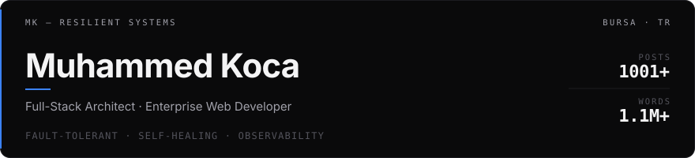
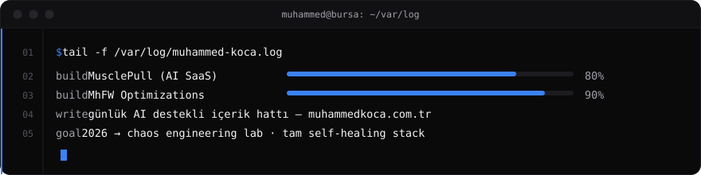
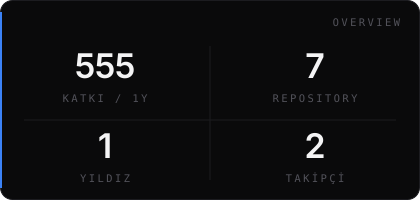
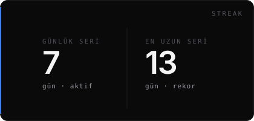
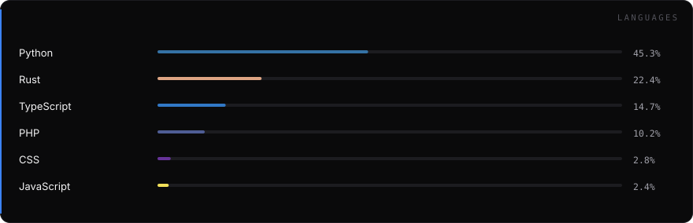
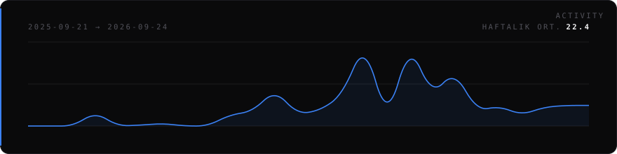

<!--
  ⚙️ Otomatik güncellenen bölümler:
     · blog kartları  (blog-posts.yml, 6 saatte bir)
     · proje kartları (projects.yml,   6 saatte bir — muhammedkoca.com.tr/projeler)
     · GitHub kartları (stats-cache.yml, günlük)
     · yılan (snake.yml, günlük)
  🎨 Header / divider / footer / terminal görselleri: assets/ klasöründeki el yapımı
  animasyonlu SVG'ler — harici servis yok.
  📖 Kurulum: KURULUM-REHBERI.md
-->

<!-- ═══ El yapımı animasyonlu header — assets/header.svg ═══ -->

  

&nbsp;
&nbsp;

## ⚡ whoami

## 🧰 Stack

**Frontend & Frameworks**

**Backend & Data**

**DevOps & System**

## 🚀 Projeler

<!-- Bu tablo scripts/generate_projects.py tarafından muhammedkoca.com.tr/projeler
     sayfasından üstten 10 proje kartı çekilerek üretilir. -->
<!-- PROJECTS:START -->
<table>
  <tr>
    <td width="50%" valign="top">
      ▸ <b><a href="https://www.muhammedkoca.com.tr/projeler/mk-homelab">Mk HomeLab</a></b> 
      Kendi sunucumu tek panelden yönetmek için geliştirdiğim self-hosted homelab kontrol merkezi. Canlı donanım/Docker izleme, web terminal ve… <code>FastAPI</code> · <code>Next.js</code> · <code>Python</code> · <code>React</code>
    </td>
    <td width="50%" valign="top">
      ▸ <b><a href="https://www.muhammedkoca.com.tr/projeler/fastcom-next-js-16-multi-tenant-multi-vendor-e-commerce">FastCom — Next.js 16 Multi-Tenant &amp; Multi-Vendor E-Commerce</a></b> 
      Next.js 16, React 19 ve TypeScript mimarisiyle geliştirilmiş, yüksek performanslı ve çok satıcılı (Multi-Vendor) E-Ticaret SaaS altyapısı… <code>Next.js 16</code> · <code>React 19</code> · <code>Prisma ORM</code> · <code>TypeScript</code>
    </td>
  </tr>
  <tr>
    <td width="50%" valign="top">
      ▸ <b><a href="https://www.muhammedkoca.com.tr/projeler/musclepull-ai-destekli-fitness-beslenme-platformu">MusclePull - AI Destekli Fitness &amp; Beslenme Platformu</a></b> 
      MusclePull - Uçtan Uca Yapay Zeka Destekli Kişisel Gelişim Platformu Antrenman, beslenme, su ve takviye takibini tek bir noktada toplayan… <code>Next.js</code> · <code>TypeScript</code> · <code>PostgreSQL</code> · <code>Prisma</code>
    </td>
    <td width="50%" valign="top">
      ▸ <b><a href="https://www.muhammedkoca.com.tr/projeler/mkmrp-acik-kaynak-erp">MkMrp — Açık Kaynak ERP</a></b> 
      İşletmelerin doğrudan kullanabileceği veya özelleştirebileceği açık kaynak Kurumsal Kaynak Planlama (ERP) altyapısı. Next.js 15, TypeScript… <code>Next.js</code> · <code>TypeScript</code> · <code>Prisma</code> · <code>Tailwind CSS</code>
    </td>
  </tr>
  <tr>
    <td width="50%" valign="top">
      ▸ <b><a href="https://www.muhammedkoca.com.tr/projeler/mk-framework">Mk Framework</a></b> 
      Python ve React mimarileri üzerine inşa edilmiş, full-stack web uygulaması geliştirme süreçlerini hızlandıran özel bir framework altyapısı… <code>Python</code> · <code>React</code> · <code>Full-Stack</code> · <code>Framework</code>
    </td>
    <td width="50%" valign="top">
      ▸ <b><a href="https://www.muhammedkoca.com.tr/projeler/sry-production-tracking-system">SRY Production Tracking System</a></b> 
      İşletmeler için dinamik vardiya rotasyonu ve anlık randıman analizi sunan üretim ve performans yönetim sistemi. Excel entegrasyonuyla ham… <code>PHP</code> · <code>MySQL</code> · <code>JavaScript</code> · <code>Excel Integration</code>
    </td>
  </tr>
  <tr>
    <td width="50%" valign="top">
      ▸ <b><a href="https://www.muhammedkoca.com.tr/projeler/mhengine-universal-design-to-code-platform">MhEngine — Universal Design-to-Code Platform</a></b> 
      Görsel sürükle-bırak tasarımları AST tabanlı derleyici motoruyla React, Vue, Svelte, Flutter ve PHP Blade kodlarına dönüştüren enterprise… <code>No-Code</code> · <code>Low-Code</code> · <code>Code Generator</code> · <code>Compiler</code>
    </td>
    <td width="50%" valign="top">
      ▸ <b><a href="https://www.muhammedkoca.com.tr/projeler/planter-gercek-zamanli-gorev-yonetim-platformu-web-desktop">PlanTer - Gerçek Zamanlı Görev Yönetim Platformu (Web &amp; Desktop)</a></b> 
      Web ve masaüstü platformlarında eş zamanlı çalışan, gerçek zamanlı veri senkronizasyonlu görev ve verimlilik platformu. Offline-First… <code>Next.js</code> · <code>Electron</code> · <code>TypeScript</code> · <code>Node.js</code>
    </td>
  </tr>
  <tr>
    <td width="50%" valign="top">
      ▸ <b><a href="https://www.muhammedkoca.com.tr/projeler/muhammed-koca-ai-destekli-blog-cms-platformu">Muhammed Koca — AI Destekli Blog &amp; CMS Platformu</a></b> 
      Astro SSR, TypeScript ve Prisma/PostgreSQL üzerine kurulu; çoklu-sağlayıcılı yapay zeka ile otomatik içerik üreten, uçtan uca kendim… <code>Astro</code> · <code>TypeScript</code> · <code>Prisma</code> · <code>PostgreSQL</code>
    </td>
    <td width="50%" valign="top">
      ▸ <b><a href="https://www.muhammedkoca.com.tr/projeler/python-full-stack-blog-messaging-system">Python Full-Stack Blog &amp; Messaging System</a></b> 
      Python tabanlı modern bir mimariyle geliştirilmiş, içerik paylaşımı ve anlık iletişime odaklanan sosyal platform. WebSocket altyapısı ve… <code>Python</code> · <code>React</code> · <code>FastAPI</code> · <code>WebSockets</code>
    </td>
  </tr>
</table>
<!-- PROJECTS:END -->

Tam liste → <a href="https://www.muhammedkoca.com.tr/projeler">muhammedkoca.com.tr/projeler</a>

## 📡 Canlı Durum

## 📊 GitHub

<!-- Bu 4 kart, DOĞRUDAN GitHub API'sinden (scripts/generate_stats.py) üretilir ve
     assets/cache/ altına yazılır. Hiçbir dış render servisine (vercel.app, demolab.com)
     bağımlı değildir — tek veri kaynağı GitHub'ın kendisi. -->
<table align="center">
  <tr>
    <td align="center" width="50%"></td>
    <td align="center" width="50%"></td>
  </tr>
</table>

## ✍️ Son Yazılar

<!-- Bu kartlar scripts/generate_blog_cards.py tarafından üretilir. Kapak görselleri
     sitenin KENDİ og:image'inden alınır (muhammedkoca.com.tr/api/og/cover.svg) —
     URL'yi biz kurmuyoruz, sitenin ürettiği meta etiketi doğrudan kopyalıyoruz. -->
<!-- BLOG-CARDS:START -->
<table>
  <tr>
    <td width="260"></td>
    <td valign="top" width="580">
       11 Ağu 2026  
      <a href="https://www.muhammedkoca.com.tr/blog/3-pratik-adim-eski-donanimi-nas-ile-yeniden-kullanma"><b>3 Pratik Adım: Eski Donanımı NAS ile Yeniden Kullanma</b></a>  
      Eski bilgisayarları veya donanımıNAS (Network Attached Storage) olarak kullanmak, depolama sorunlarına pratik bir çözüm sunar. İşte NAS nedir ve…
    </td>
  </tr>
  <tr><td colspan="2"></td></tr>
  <tr>
    <td width="260"></td>
    <td valign="top" width="580">
       10 Ağu 2026  
      <a href="https://www.muhammedkoca.com.tr/blog/nas-nedir-evdeki-tum-cihazlariniz-icin-guvenli-ve-akilli-depolama-cozumu"><b>NAS Nedir? Evdeki Tüm Cihazlarınız İçin Güvenli ve Akıllı Depolama Çözümü</b></a>  
      NAS (Ağ Depolama Sistemi), evinizdeki tüm cihazların verilerini tek bir merkezde güvenli ve erişilebilir şekilde saklamanızı sağlar. Peki NAS nedir…
    </td>
  </tr>
  <tr><td colspan="2"></td></tr>
  <tr>
    <td width="260"></td>
    <td valign="top" width="580">
       10 Ağu 2026  
      <a href="https://www.muhammedkoca.com.tr/blog/bilgisayariniz-yavasladi-diye-uzulmeyin-iste-gercek-nedenleri-ve-hizlandirma-reh"><b>Bilgisayarınız Yavaşladı Diye Üzülmeyin: İşte Gerçek Nedenleri ve Hızlandırma Rehberi</b></a>  
      Bilgisayarınızın zamanla yavaşlaması yaygın bir durumdur, ancak çoğu zaman basit adımlarla eski hızına kavuşturabilirsiniz. Bu rehberde, bilgisayar…
    </td>
  </tr>
</table>
<!-- BLOG-CARDS:END -->

📡 6 saatte bir <a href="https://www.muhammedkoca.com.tr/rss.xml">rss.xml</a> üzerinden otomatik güncellenir, kapak görselleri sitenin kendi og:image'inden gelir · tümü → <a href="https://www.muhammedkoca.com.tr/blog">/blog</a>

## 🐍 Contribution Snake

<!-- Yılan: snake.yml çalıştıktan sonra görünür. Renkler mor-cyan özel palet. -->

  <picture>
    <source media="(prefers-color-scheme: dark)" srcset="https://raw.githubusercontent.com/Mhuseyin7/Mhuseyin7/output/snake-dark.svg">
    
  </picture>

 

<!-- ═══ El yapımı animasyonlu footer — assets/footer.svg ═══ -->

  
  <i>Bu profil işine yaradıysa <a href="https://github.com/Mhuseyin7">takip et</a> — dirençli mimariler ve gerçek production senaryoları üzerine üretiyorum.</i>

