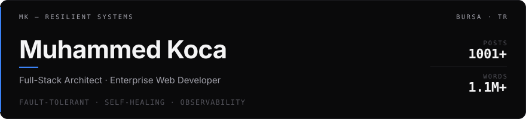
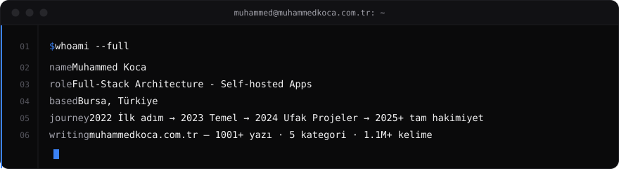
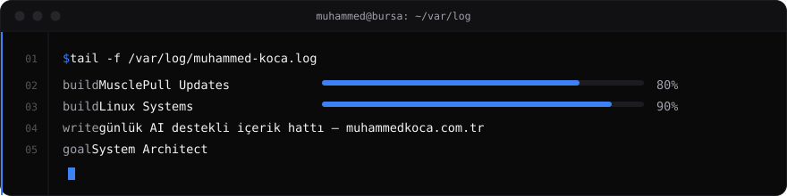

<!--
  ⚙️ Auto-updated sections:
     · blog cards    (blog-posts.yml,   every 6h)
     · project cards (projects.yml,     every 6h — muhammedkoca.com.tr/projeler)
     · GitHub cards  (stats-cache.yml,  daily)
     · contribution  (snake.yml,        daily)
  🎨 Header / divider / footer / terminal / architecture / now / milestones
     visuals: hand-crafted animated SVGs in assets/ — no external service.
  📖 Setup notes: KURULUM-REHBERI.md
-->

<!-- ═══ Animated header — assets/header.svg ═══ -->

  

 

&nbsp;
&nbsp;
&nbsp;

## ⚡ whoami

## 🧰 Stack

**Frontend & Frameworks**

**Backend & Data**

**DevOps & System**

 

## 🏗️ Architecture Map

Four-tier stack (Edge → App → API → Data) sitting on a self-hosted bare-metal base, wrapped by a shared observability + self-heal loop.

## 🎯 Now

## 🗓️ Milestones

## 🚀 Projects

<!-- Cards below are rendered by scripts/generate_projects.py from the site's
     projects listing at muhammedkoca.com.tr/projeler. Top 10 cards. -->
<!-- PROJECTS:START -->
<table>
  <tr>
    <td width="50%" valign="top">
      <b>▸ <a href="https://www.muhammedkoca.com.tr/projeler/mk-homelab">Mk HomeLab</a></b> 
      Kendi sunucumu tek panelden yönetmek için geliştirdiğim self-hosted homelab kontrol merkezi. Canlı donanım/Docker izleme, web terminal ve… <code>FastAPI</code> · <code>Next.js</code> · <code>Python</code> · <code>React</code>
    </td>
    <td width="50%" valign="top">
      <b>▸ <a href="https://www.muhammedkoca.com.tr/projeler/fastcom-next-js-16-multi-tenant-multi-vendor-e-commerce">FastCom — Next.js 16 Multi-Tenant &amp; Multi-Vendor E-Commerce</a></b> 
      Next.js 16, React 19 ve TypeScript mimarisiyle geliştirilmiş, yüksek performanslı ve çok satıcılı (Multi-Vendor) E-Ticaret SaaS altyapısı… <code>Next.js 16</code> · <code>React 19</code> · <code>Prisma ORM</code> · <code>TypeScript</code>
    </td>
  </tr>
  <tr>
    <td width="50%" valign="top">
      <b>▸ <a href="https://www.muhammedkoca.com.tr/projeler/musclepull-ai-destekli-fitness-beslenme-platformu">MusclePull - AI Destekli Fitness &amp; Beslenme Platformu</a></b> 
      MusclePull - Uçtan Uca Yapay Zeka Destekli Kişisel Gelişim Platformu Antrenman, beslenme, su ve takviye takibini tek bir noktada toplayan… <code>Next.js</code> · <code>TypeScript</code> · <code>PostgreSQL</code> · <code>Prisma</code>
    </td>
    <td width="50%" valign="top">
      <b>▸ <a href="https://www.muhammedkoca.com.tr/projeler/mkmrp-acik-kaynak-erp">MkMrp — Açık Kaynak ERP</a></b> 
      İşletmelerin doğrudan kullanabileceği veya özelleştirebileceği açık kaynak Kurumsal Kaynak Planlama (ERP) altyapısı. Next.js 15, TypeScript… <code>Next.js</code> · <code>TypeScript</code> · <code>Prisma</code> · <code>Tailwind CSS</code>
    </td>
  </tr>
  <tr>
    <td width="50%" valign="top">
      <b>▸ <a href="https://www.muhammedkoca.com.tr/projeler/mk-framework">Mk Framework</a></b> 
      Python ve React mimarileri üzerine inşa edilmiş, full-stack web uygulaması geliştirme süreçlerini hızlandıran özel bir framework altyapısı… <code>Python</code> · <code>React</code> · <code>Full-Stack</code> · <code>Framework</code>
    </td>
    <td width="50%" valign="top">
      <b>▸ <a href="https://www.muhammedkoca.com.tr/projeler/sry-production-tracking-system">SRY Production Tracking System</a></b> 
      İşletmeler için dinamik vardiya rotasyonu ve anlık randıman analizi sunan üretim ve performans yönetim sistemi. Excel entegrasyonuyla ham… <code>PHP</code> · <code>MySQL</code> · <code>JavaScript</code> · <code>Excel Integration</code>
    </td>
  </tr>
  <tr>
    <td width="50%" valign="top">
      <b>▸ <a href="https://www.muhammedkoca.com.tr/projeler/mhengine-universal-design-to-code-platform">MhEngine — Universal Design-to-Code Platform</a></b> 
      Görsel sürükle-bırak tasarımları AST tabanlı derleyici motoruyla React, Vue, Svelte, Flutter ve PHP Blade kodlarına dönüştüren enterprise… <code>No-Code</code> · <code>Low-Code</code> · <code>Code Generator</code> · <code>Compiler</code>
    </td>
    <td width="50%" valign="top">
      <b>▸ <a href="https://www.muhammedkoca.com.tr/projeler/planter-gercek-zamanli-gorev-yonetim-platformu-web-desktop">PlanTer - Gerçek Zamanlı Görev Yönetim Platformu (Web &amp; Desktop)</a></b> 
      Web ve masaüstü platformlarında eş zamanlı çalışan, gerçek zamanlı veri senkronizasyonlu görev ve verimlilik platformu. Offline-First… <code>Next.js</code> · <code>Electron</code> · <code>TypeScript</code> · <code>Node.js</code>
    </td>
  </tr>
  <tr>
    <td width="50%" valign="top">
      <b>▸ <a href="https://www.muhammedkoca.com.tr/projeler/muhammed-koca-ai-destekli-blog-cms-platformu">Muhammed Koca — AI Destekli Blog &amp; CMS Platformu</a></b> 
      Astro SSR, TypeScript ve Prisma/PostgreSQL üzerine kurulu; çoklu-sağlayıcılı yapay zeka ile otomatik içerik üreten, uçtan uca kendim… <code>Astro</code> · <code>TypeScript</code> · <code>Prisma</code> · <code>PostgreSQL</code>
    </td>
    <td width="50%" valign="top">
      <b>▸ <a href="https://www.muhammedkoca.com.tr/projeler/python-full-stack-blog-messaging-system">Python Full-Stack Blog &amp; Messaging System</a></b> 
      Python tabanlı modern bir mimariyle geliştirilmiş, içerik paylaşımı ve anlık iletişime odaklanan sosyal platform. WebSocket altyapısı ve… <code>Python</code> · <code>React</code> · <code>FastAPI</code> · <code>WebSockets</code>
    </td>
  </tr>
</table>
<!-- PROJECTS:END -->

Full list → <a href="https://www.muhammedkoca.com.tr/projeler">muhammedkoca.com.tr/projeler</a>

## 📡 Live Status

## 📊 GitHub

<!-- Cards below are rendered DIRECTLY from GitHub's own GraphQL API by
     scripts/generate_stats.py and written to assets/cache/. No external
     render service (vercel.app, demolab.com…) — the only data source is
     GitHub itself. Overview: total contribs, commits, PRs, issues, repos,
     stars. Streak: current, longest, reviews, active days. Activity is a
     real 26-week GitHub-style heatmap with an "MK" glyph overlay. -->
<table align="center">
  <tr>
    <td align="center" width="50%"></td>
    <td align="center" width="50%"></td>
  </tr>
</table>

## ✍️ Recent Writings

<!-- Rendered by scripts/generate_blog_cards.py from the site's RSS feed
     (muhammedkoca.com.tr/rss.xml). Cover images come from the article's own
     og:image meta tag — the URL is not hand-built. -->
<!-- BLOG-CARDS:START -->
<table>
  <tr>
    <td width="260"></td>
    <td valign="top" width="580">
       29 Tem 2026  
      <a href="https://www.muhammedkoca.com.tr/blog/dagitik-sistemlerde-performans-darbogazlarini-tespit-etmek-ve-cozmek-node-js-pri"><b>Dağıtık Sistemlerde Performans Darboğazlarını Tespit Etmek ve Çözmek: Node.js, Prisma ve Mikroservislerde İleri Düzey Optimizasyon Stratejileri</b></a>  
      Dağıtık sistemlerde performans darboğazları, çoğu zaman görünmez bir düşman gibi sisteminizi yavaş yavaş çökertir. Bu makalede, Node.js ve Prisma…
    </td>
  </tr>
  <tr><td colspan="2"></td></tr>
  <tr>
    <td width="260"></td>
    <td valign="top" width="580">
       29 Tem 2026  
      <a href="https://www.muhammedkoca.com.tr/blog/dagitik-sistemlerde-kritik-veri-tutarliligi-node-js-ve-prisma-ile-saga-pattern-u-2"><b>Dağıtık Sistemlerde Kritik Veri Tutarlılığı: Node.js ve Prisma ile Saga Pattern Uygulaması ve Prodüksiyon Felaketlerinden Dersler</b></a>  
      Dağıtık sistemlerde ACID işlemleri sağlamak, veritabanı sınırlarını aşan iş akışlarında tutarlılığı korumak kritik bir zorluktur. Bu makalede, Saga…
    </td>
  </tr>
  <tr><td colspan="2"></td></tr>
  <tr>
    <td width="260"></td>
    <td valign="top" width="580">
       29 Tem 2026  
      <a href="https://www.muhammedkoca.com.tr/blog/yuksek-performansli-muhendislik-zihni-24-saatlik-uretkenlik-dongusunu-yeniden-ta"><b>Yüksek Performanslı Mühendislik Zihni: 24 Saatlik Üretkenlik Döngüsünü Yeniden Tasarlamak</b></a>  
      15 yıllık üretim sistemleri mimarisinde edindiğim tecrübeler, mühendislik verimliliğinin kod yazmaktan ibaret olmadığını gösterdi. Gerçek yüksek…
    </td>
  </tr>
</table>
<!-- BLOG-CARDS:END -->

📡 Auto-refreshed every 6h from <a href="https://www.muhammedkoca.com.tr/rss.xml">rss.xml</a>; cover images pulled from each article's own og:image · full archive → <a href="https://www.muhammedkoca.com.tr/blog">/blog</a>

## 🚘 Contribution Traffic

<!-- Car: shown after snake.yml runs. Light/dark theme aware. -->

  <picture>
    <source media="(prefers-color-scheme: dark)" srcset="https://raw.githubusercontent.com/Mhuseyin7/Mhuseyin7/output/contribution-car-dark.svg">
    
  </picture>

## 📮 Get in Touch

<table>
  <tr>
    <td align="center" width="20%">
       
      muhammedkoca.com.tr
    </td>
    <td align="center" width="20%">
       
      Muhammed Koca
    </td>
    <td align="center" width="20%">
       
      @muhammedkoca.dev
    </td>
    <td align="center" width="20%">
       
      mhuseyinkoca9@gmail.com
    </td>
    <td align="center" width="20%">
       
      rss.xml
    </td>
  </tr>
</table>

 

<!-- ═══ Animated footer — assets/footer.svg ═══ -->

  
  <i>If this profile was useful to you, <a href="https://github.com/Mhuseyin7">follow along</a> — I build resilient architectures &amp; ship real production stories.</i>

